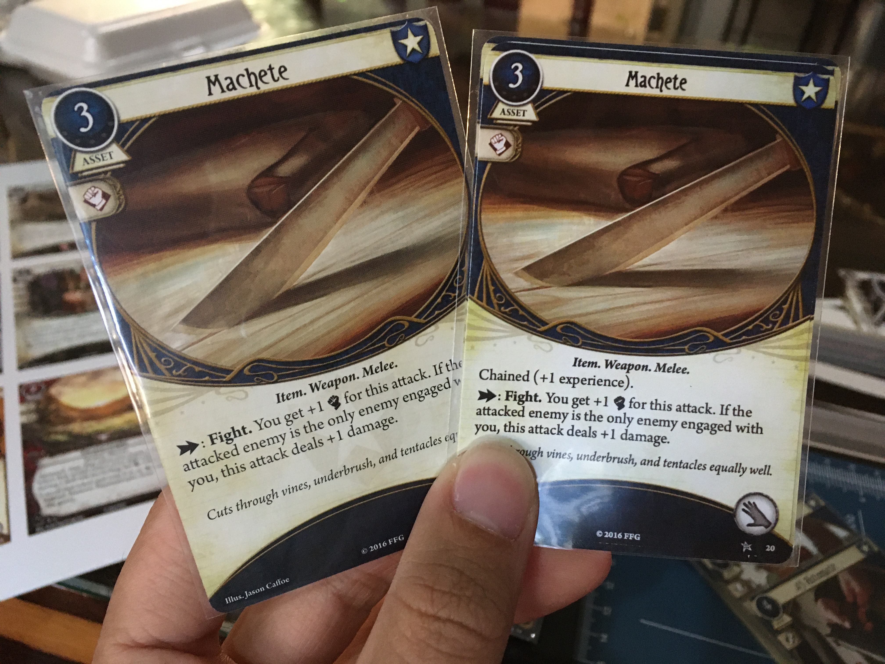
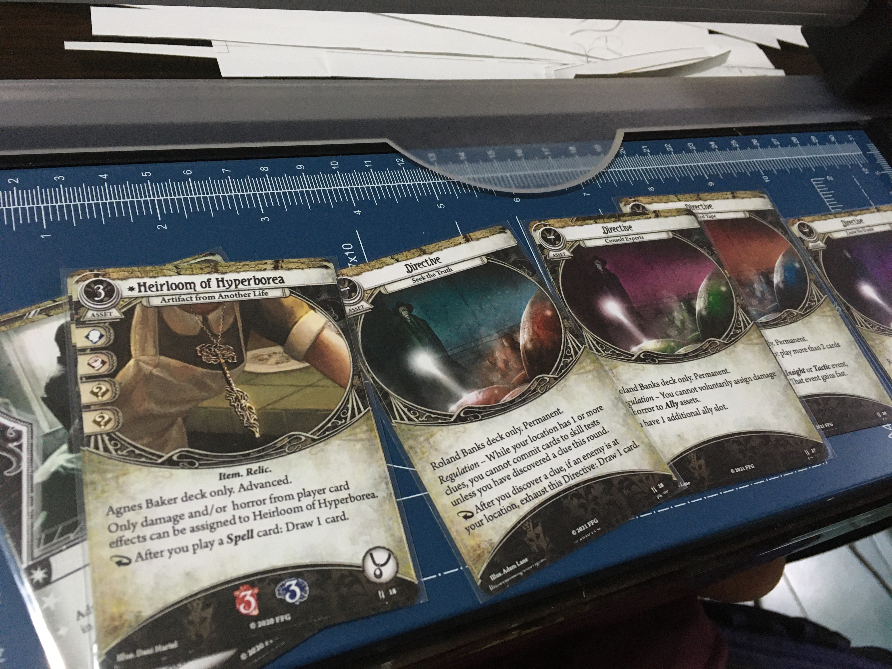
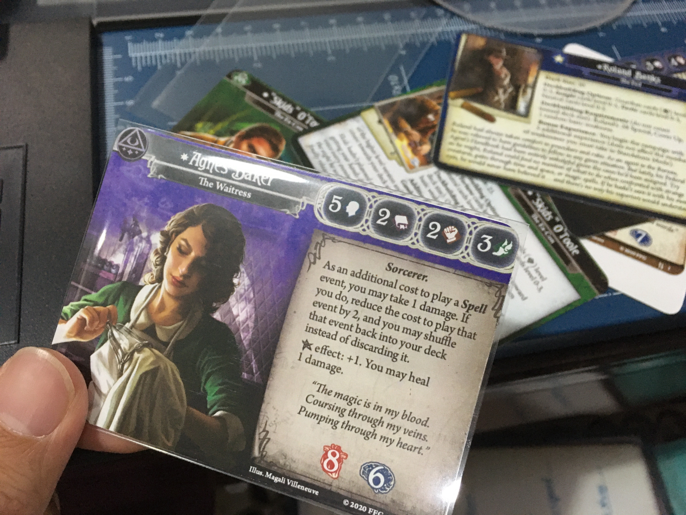
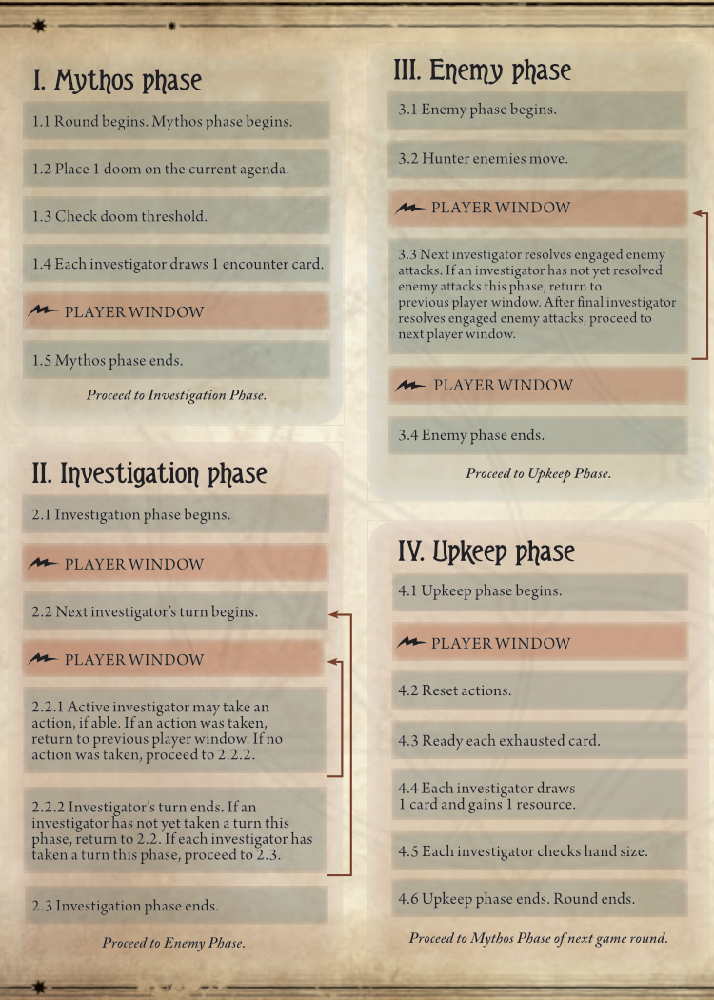
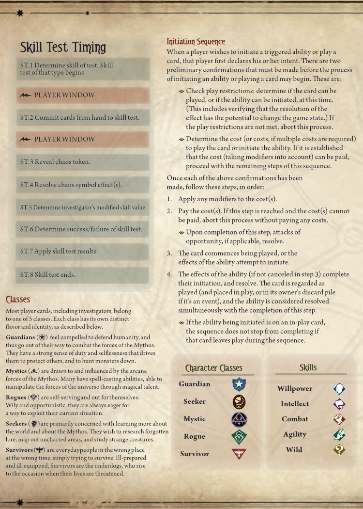
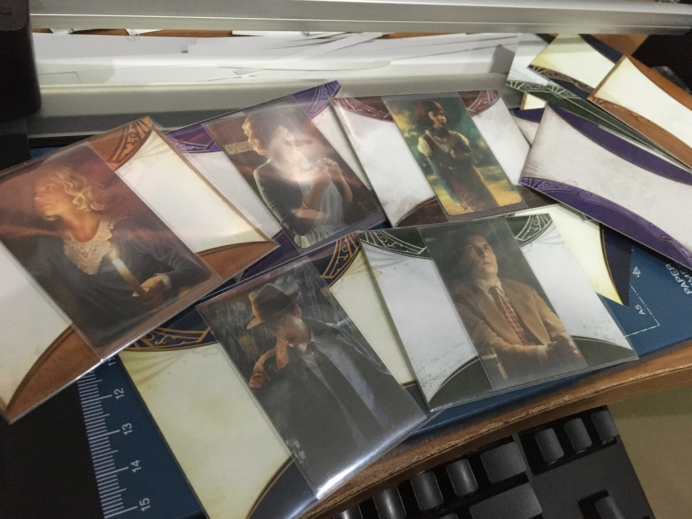
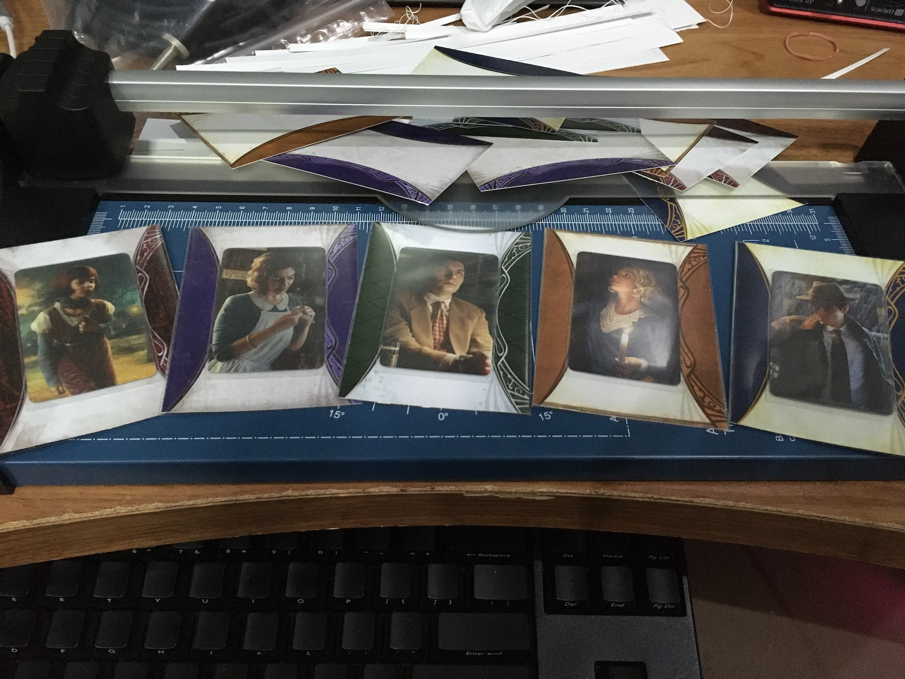

# Print and Play

This folder is not related with the 3mm dividers, I just need somewhere to host these and I think this repo is the best location for me.

## Contents

These are all based on A4 size paper printing. After clicking PDF link, press the Downlaod button inside.

### Smaller Print and Play

Player cards from all 5 parallel investigator set plus some taboo cards of core set, Dunwich, and Carcosa.

But these are **smaller**, an intention is so you can print on thin paper and slot it in front of genuine sleeved card, to get the best experience possible if you don't have access to playing card printing service. If these cards were original size, sometimes the edge would poke out from the side and it would reveal the card while faced down in the deck.

To get the "correct smaller size", print all these on A4 paper. Final result will be about ~1 mm smaller from each side.

- [PDF (5 pages)](./SmallerPrintAndPlay.pdf)
- [afdesign](./SmallerPrintAndPlay.afdesign)

This is how smaller overlay looks like on the front, compared with the original. I also used 4 mm paper corner punch which the radius is a bit bigger than official cards.

These are all overlaid on spare Flashlight, Emergency Cache, and Knife.

### Parallel Investigators

5 parallel investigators, Mutated Rex Murphy (in smaller size for overlay, and original size), and remaining space filled with Promo Parallel Daisy and Skids. Original size FFG provided is 62.5mm x 88.7 mm. Print on A4 with no scaling to get this size.

Each one is stuck in pair, so you can either fold or cut them if you want to play with mixed front/back of that investigator.

- [PDF (2 pages)](./ParallelInvestigators.pdf)
- [afdesign](./ParallelInvestigators.afdesign)

Here is an example of finished print. I also used 4mm paper corner punch which the radius is a bit bigger than official cards.

### Timing and Gameplay

Extremely small reference card of the slightly enlarged flow chart from the rule book. Used to remember where are all the Player Window in between steps. The `x4` file will get you 4 double-sided reference cards in one A4.

- [TimingAndGameplayABx4 PDF](./TimingAndGameplayABx4.pdf)
- [TimingAndGameplayABx4 afdesign](./TimingAndGameplayABx4.afdesign)
- [TimingAndGameplayAB afdesign](./TimingAndGameplayAB.afdesign)
- [TimingAndGameplayA png](./TimingAndGameplayA.png)
- [TimingAndGameplayB png](./TimingAndGameplayB.png)

### Box-fitted campaign logs

These are from official FFG online campaign PDF, but stripped out only the last few pages with the log, centered on A4 paper, and scale down such that after cutting white area out on the printed A4, it fits back in the revised core set box/new format campaign box. (Accounting for 1 cm laminate padding each side of the log.)

Print in color then laminate it, then you can use non-permanent markers (wash with water, such as white barrel Staedtler Lumocolor) to reuse the colored log over and over. [This Night of the Zealot log (NotZ spoiler in this image)](https://github.com/5argon/AHLCG3mmDivider/blob/main/PrintAndPlay/Images/laminated-log.jpg?raw=true) was used for about 4 replays and it cleaned up very well with no trace of the previous play.

- [Night of the Zealot](./CampaignLogs/NightOfTheZealot.pdf)
- [Edge of the Earth](./CampaignLogs/EdgeOfTheEarth.pdf)

### Backdrop

The KMC Character Sleeve happened to be just the right size to store the sleeved mini cards as well. Doing so make the mini cards expanded to regular card size, and can be stored neatly near the investigator card.

I thought the mini card floating inside empty Character Sleeve is a bit boring, so I made some backdroup graphics for this. It also improve the tightness and make the mini card harder to slip out the sleeve.

The graphic are remixed from FFG official cards. I did nothing.

#### Design 1

- [Guardian](./Backdrop/backdrop-guardian.png)
- [Mystic](./Backdrop/backdrop-mystic.png)
- [Neutral](./Backdrop/backdrop-neutral.png)
- [Rogue](./Backdrop/backdrop-rogue.png)
- [Seeker](./Backdrop/backdrop-seeker.png)
- [Survivor](./Backdrop/backdrop-survivor.png)

#### Design 2

- [Guardian](./Backdrop/backdrop2-guardian.png)
- [Mystic](./Backdrop/backdrop2-mystic.png)
- [Neutral](./Backdrop/backdrop2-neutral.png)
- [Rogue](./Backdrop/backdrop2-rogue.png)
- [Seeker](./Backdrop/backdrop2-seeker.png)
- [Survivor](./Backdrop/backdrop2-survivor.png)

### Chaos Token Tuck Boxes

A box for storing your unused chaos tokens in the new format campaign box, since the width was designed to exactly fit the insert's width. Inside the box, there are folding dividers so you can store the coins upright, making it easy to pick the right symbol and keep them separated.

One box can hold up to 16 tokens that are in 25~26 cheapo coin capsule. If a box design has less than 16 tokens capacity, the folding divider gets thicker instead so the coin slot still fits snugly and they stay upright.

- [3 4 5 4](./chaos-token-tuck-boxes/3%204%205%204.png) : Intended for `+1 +1 +1 | 0 0 0 0 | 1 1 1 1 1 | -2 -2 -2 -2`
- [3 2 2 3 2](./chaos-token-tuck-boxes/3%202%202%203%202.png) : Intended for `-3 -3 -3 | -4 -4 | -5 -5 | -6 -7 -8 | Auto-Fail ElderSign`
- [4 4 4 4](./chaos-token-tuck-boxes/4%204%204%204.png) : Intended for 4x each of special symbol tokens.
- [2 2 2 2](./chaos-token-tuck-boxes/2%202%202%202.png) : Intended for Edge of the Earth's 8x frost tokens.
- [2 2 2 2 2](./chaos-token-tuck-boxes/2%202%202%202%202.png) : Intended for 10x bless or curse tokens. (So you need 2 boxes to store both.)
- [Dividers Only](./chaos-token-tuck-boxes/dividers-only.png)

The folding divider is the strip on top of each file. Colored part is to be vertical wall and white part is parallel to the box's bottom.