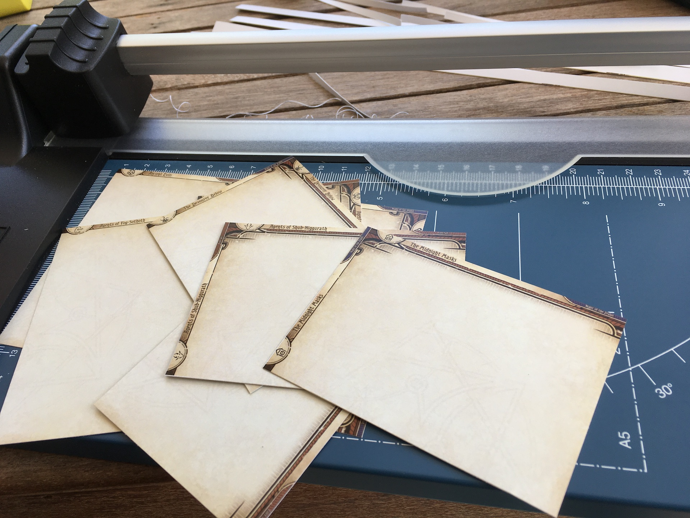

# AH:LCG 3mm Dividers

Card divider graphics you can print out and cut up to use with [Arkham Horror : The Card Game (LCG)](https://www.fantasyflightgames.com/en/products/arkham-horror-the-card-game/).

Unlike other dividers, they have a bit of unusual traits that leads to me making them on my own : 

- **As small as possible** : Size is 93mm x 68mm. In comparison, the size of standard size card is 89mm x 64mm, which gets +1mm to 90mm x 65mm when fitted with perfect sleeves. (+0.5mm for each side.)
  
  The 3mm difference becomes the name of this project : it utilizes just that tiny 3mm difference to display all of divider's graphics and texts.
  
  Tiny texts are actually great when reading at lower angle, you can see more dividers behind it. Very useful when there are a lot of categories with as few as 2-4 cards in this game.
  
  These dividers are best if you use perfect fit sleeves on all your cards or not sleeving at all, otherwise the cards maybe too tall and obscure the dividers.
- **High compatibility** : When the divider is not much taller than the cards, it is mostly compatible with any box you used for your cards without folding it. Using these dividers in the Revised Core Set box won't add too much height. The box still closes just fine even with that left over token punch-out cardboard in the box. I have tested with Ultimate Guard Boulder and Sidewinder and those boxes can still close.
- **Can be sleeved** : This 93mm x 68mm number is chosen for one more reason : You can sleeve the divider with "outer sleeve" designed to cover character sleeves in one more layer.

  KMC Character Sleeve Guard has dimension 94mm x 69mm, which will make this 93mm x 68mm a perfect fit inside it.

  This eliminates the need of lamination machine to reinforce your dividers if you want to.
- **Dual orientations** : It has graphics for both landscape and portrait arrangement. This gives you flexibility in your storage solution which may change in the future as you get more expansions.

  There are inevitably some overlaps but graphics from each orientation tries to be as hidden as possible from the other orientation, especially the texts.

  Though, I designed it mainly for landscape since I just bought a Revised Core Set and is still storing everything in that box. The "bonus" vertical graphics maybe a bit cramped.
- **Easy to work on** : The graphics are generated from applied usage of Unity game engine (also hosted in this repository), which makes them consistent in layout, easy to add more in the future, or batch-modifying mistakes on all previous ones less tedious.

## More images

See them in the [gallery page](./gallery.md) to see if they would work in your storage solution or not.

## Attributions

All encounter icons were obtained from combined effort in [this thread](https://boardgamegeek.com/thread/1671881/article/38760017#38760017).

Card graphics was remixed from official FFG print-and-play PDF. I didn't design anything other than putting texts, icons, and recolor a bit.

## Overview

- `Design` : Affinity Designer file that exports graphics for `Unity` folder.
- `Unity` : Unity game engine project that would output divider graphics for `Files` folder.
- `Files` : Individual divider graphics grouped in sensible folders. In each folder are multiple of 8 cards which is a maximum number that would fit in 1 A4 paper. If graphics in a category barely missed multiple of 8, they are filled up with some unrelated generic dividers as extras.
- `Pdfs` : Each folders in `Files` made into a PDF files so it is easier to send them to print shops. If you require a mix of some dividers here and there, you should pick individual files in `Files` and make your own A4 for printing.
- `Images` : Store images shown in this page.

## How to use

Download everything as a `.zip` by clicking the **green button** on around top-right corner of this page then select "Download ZIP".

Then, you likely would need to look in either `Files` or `Pdfs` folder. Send those graphics to A4 printer.

After that you can cut them up. You will be making skill test (4) on cutting since there is little room for error before the text is also trimmed off. I also forgot to make the graphic bleed outside of cut line to accommodate cutting errors.

### Making custom graphics

`Unity` folder can be used to generate new graphics by opening it with Unity game engine. But it is likely only make sense to me since I hadn't putting in that much effort to make the project understandable.

If you don't know how to use Unity and have any requests of new graphics, it maybe easier if you contact me. (pyasry@gmail.com, [BGG forum thread](https://boardgamegeek.com/thread/2766339/3mm-divider-designs-available-download), here in the Issues section, etc.) If I have time I maybe able to quickly update the renders.

I only own the Revised Core Set at the moment, so I myself isn't in a hurry to print more dividers... I likely be getting expansions released in new format starting from Edge of the Earth and add more dividers accordingly.

## Brief explanation of the Unity project

Assuming you know how to use Unity, you can use the project to generate custom dividers with any text and icons. These can help you understand the project structure faster : 

- Right click `Asset` menu has an asset called `GenSpec`, which the `Runner` on the scene has `GenSpec[]` exposed. Follow the script of `GenSpec` and you should understand the rest.
- When you enter Play Mode, `Runner` object will run a coroutine that "apply" the `GenSpec` one by one per frame. You will see various graphics flashes rapidly.
- The project has [Unity Recorder](https://docs.unity3d.com/Packages/com.unity.recorder@latest/manual/index.html) installed. By running the Recorder and use frame range mode, we can effectively export everything as it cycles to different graphics per frame. The frame range starts at 3, for some reason Unity lags for a few frames.
- Game view and Recorder should be set to 1098x804. (Becomes 93mm x 68mm at 300 DPI)
- To make Recorder output file name according to `GenSpec` asset name, it can use `<Scene>` name placeholder. Then the code create a scene dynamically each frame and set it as active, "tricking" the recorder to name the file according to scene's name. (Which is actually the asset's name.)