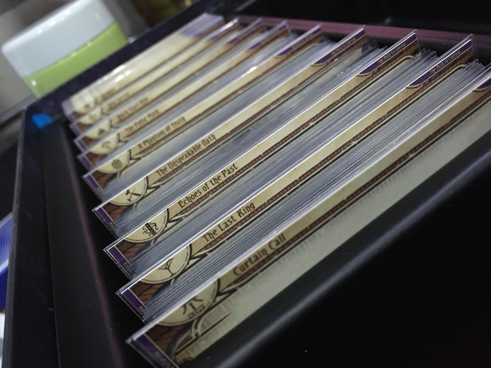
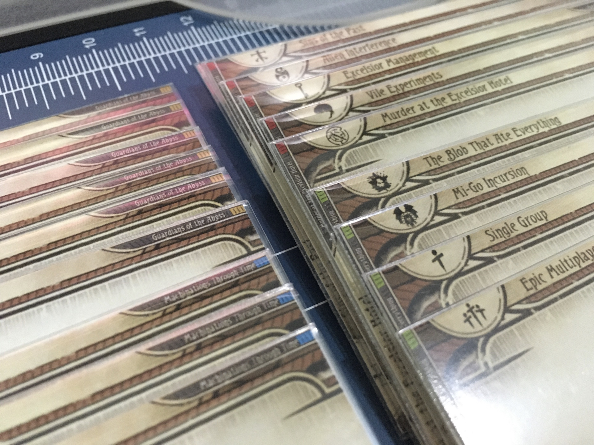
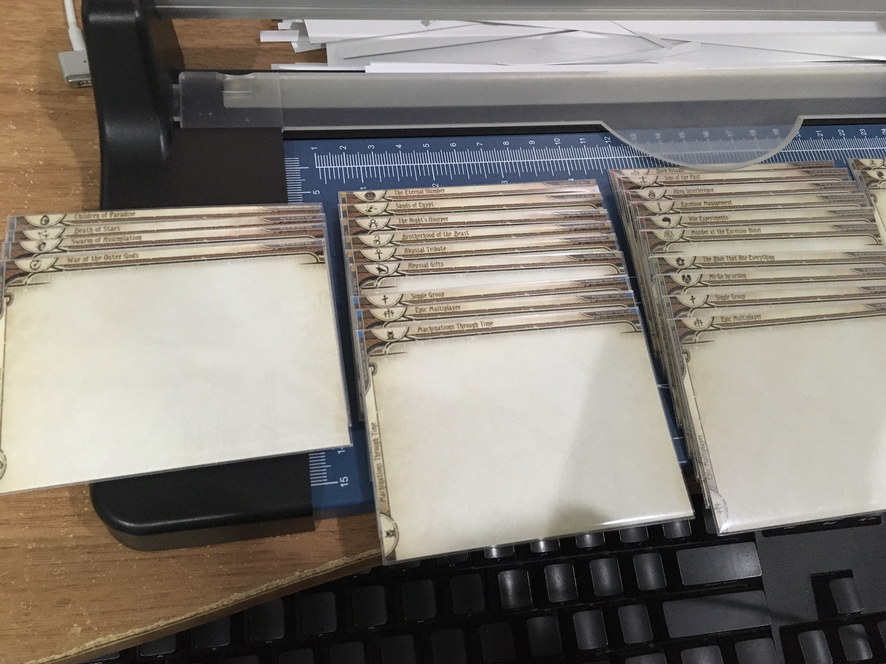

# List of Dividers

Each "set" is one folder inside the language folder. You will collect divider graphics from different sets together then layout them according to the [printing guide](./print.md). If there are blank space remaining on the last page, you can pick some individual graphics from Extra set, etc. to fill up. (With A4 printing, you should gather a multiple of 8 dividers.)

Set folder has `x` number suffixed. That is an amount of dividers inside. Perhaps they can help you estimate amount of paper needed to get everything you want. (You can selectively gather only some of them inside each set.)

## Player

- Player - Class With Levels x17 : If you want to separate Lv. 0 vs Lv. 1-5 cards of different classes. This is the most common organization from what I see other's dividers.
- Player - Class No Levels x14 : This one has no Lv. designator at the corner.
- Player - Investigator x6 : For organizing investigators by class.
- Player - Investigator By Set x9 : For organizing investigator by the set they came from. It also has set icon on top left and set name on top right.
- Player - Multi-Class x16 : More fine grained multi-class card dividers. Including every combination of 2 classes, or one saying "3 classes" for EotE talent cards.
- Player - Slot Requirement x27 : 3 dividers for each slot requirement type (No level, Lv.0, Lv. 1~5), and also "Other" so it corresponds to how ArkhamDB categorize the Asset taking no slots or multiple type of slots at once.
- Player - Misc x5 : 
  - Basic Weakness divider to bunch up all your weaknesses to shuffle and pick.
  - Permanent 
  - Bonded (The Circle Undone)
- Player - Customizable x11 / Player - Customizable With Set Strip x11 : Dividers for The Scarlet Keys Customizable and Upgrade Sheet cards in various styles and various granularity. Such as having The Scarlet Keys red set strip or not, or Upgrade Sheet divided subjectively into several smaller sections. They gave you 3 Upgrade Sheet of each, and each class has 3 different Customizable cards (neutral has one). So with a single Upgrade Sheet divider it would contain 3x3x5 = 45 + 3 neutral = 48 cards. It is up to you whether you want a big chunk of 48 cards or something smaller.

## CCQ (Cycle-Class-Quantity)

This is a collection that maximizes deck teardown speed while maintaining good deck assembling speed, requiring help from quantity number printed on the dividers and online deckbuilder like ArkhamDB. It mimics the encounter set's UX to player cards.

Look for all the folders prefixed with "CCQ".

[Head to the dedicated page to learn about this.](./cycle-class-quantity.md)

## CNR (Collector Number Range)

[Head to the dedicated page to learn about this.](./collector-number-range.md)

Look for all the folders prefixed with "CNR".

## Core Set

These are encounters they often ask for reuse when playing other campaigns. The corner is marked as "Core Set" and not "Night of the Zealot".

However, it seems FFG made a regrettable mistake in the "Night of the Zealot" campaign that there are 5 very useful encounter cards in "The Midnight Masks" scenario they love to have available in designing the scenario (2x False Lead + 3x Hunting Shadow). They often ask you to pick just those 5 cards.

Those 5 cards normally are classified as campaign cards instead of core encounters, but I have made a special "The Midnight Masks" divider with "Core Set" corner so you can store those 5 cards together with the rest of Core Set cards instead of in the campaign.

You can decide if you want to print it or not, but it was useful to me because I like moving all the needed core encounter sets to the campaign box I am playing together with the dividers. If I don't print this separated special "The Midnight Masks" divider, the rest of "The Midnight Masks" scenario cards will be left without a divider in my storage box.

## Campaigns

These are strictly 1 divider per unique set icon officially stated in the campaign guide. With these, you can rely on counting numbers printed on the corner of the card whether you had cleaned up the game properly without losing any card or not, then pack them inside the divider.

Each set has differently colored corner strip based on product box's color. It is to benefit a collection with multiple campaigns in one big box so you can see at glance where are each campaign.

- Campaign - Night of the Zealot x3
- Campaign - Edge of the Earth x24
- Campaign - The Circle Undone x21
- Campaign - The Dream-Eaters x20
- Campaign - The Dunwich Legacy x17
- Campaign - The Forgotten Age x23
- Campaign - The Innsmouth Conspiracy x18
- Campaign - The Path to Carcosa x19
- Campaign - The Scarlet Keys x26

## Return to 

- Campaign - Return to the Night of the Zealot x6
- Campaign - Return to the Path to Carcosa x13
- Campaign - Return to the Circle Undone x16

## Standalone Scenarios

Since the product box of these standalones are black, the colored corner strip gets a little secondary color based on the art or theme inside that standalone scenario. This can be useful if you decided to arrange a box of all standalones stored together.

- Standalone - Barkham Horror x2
- Standalone - Carnevale of Horrors x2
- Standalone - Curse of the Rougarou x3
- Standalone - Guardians of the Abyss x7
- Standalone - Machinations Through Time x4
- Standalone - Murder at the Excelsior Hotel x7
- Standalone - The Blob That Ate Everything x5
- Standalone - The Labyrinths of Lunacy x4
- Standalone - War of the Outer Gods x5

What may confuse you is that the first graphic of each set is the "main" icon of the standalone (shown on the bottom corner of the card near the total cards counter), and is not an actual encounter set icon. The 2nd graphic is the real encounter set icon, that is named the same as standalone.

- If you rather want a single divider per standalone no matter how many actual encounter sets are contained within, you may print **only** the first graphic in each set.
- But if you want a divider for every encounter set icons inside, print everything **except** the first graphic.